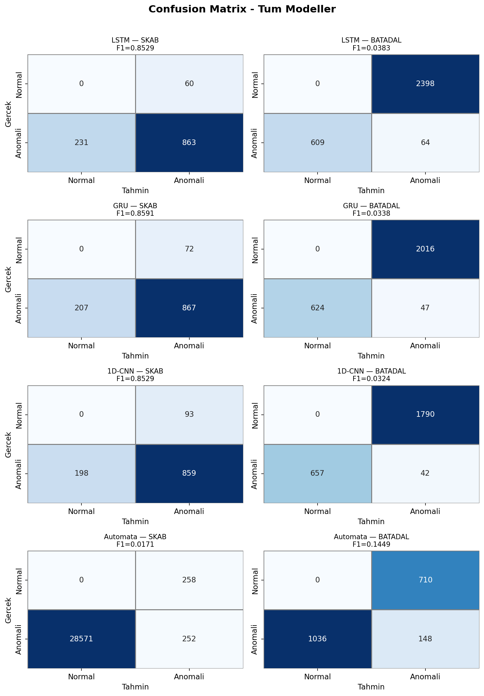
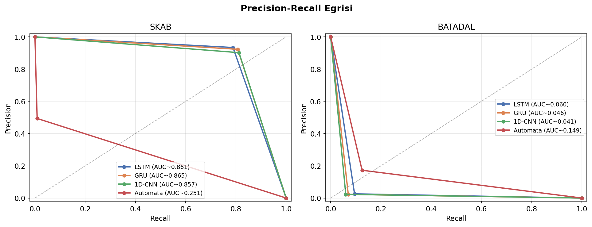
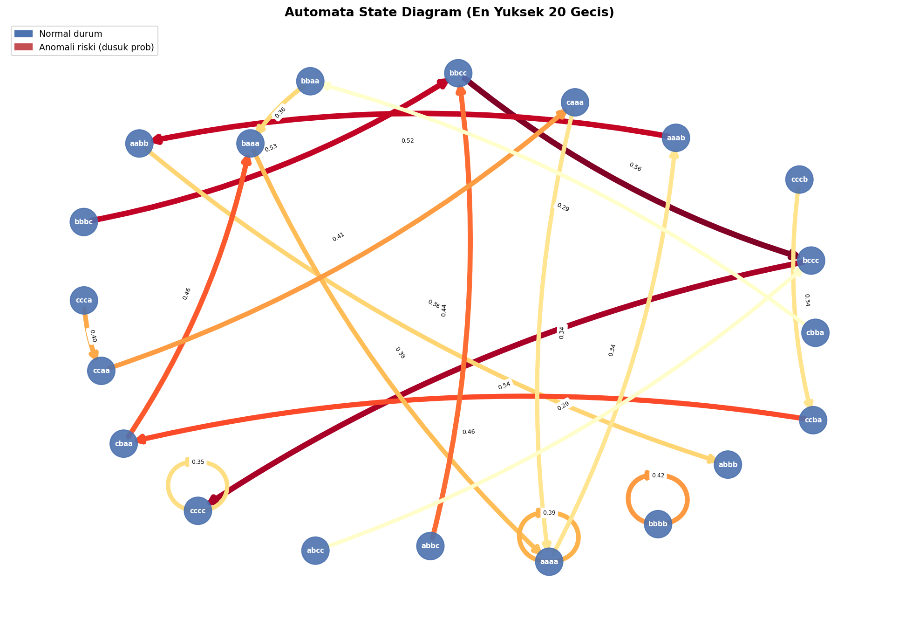
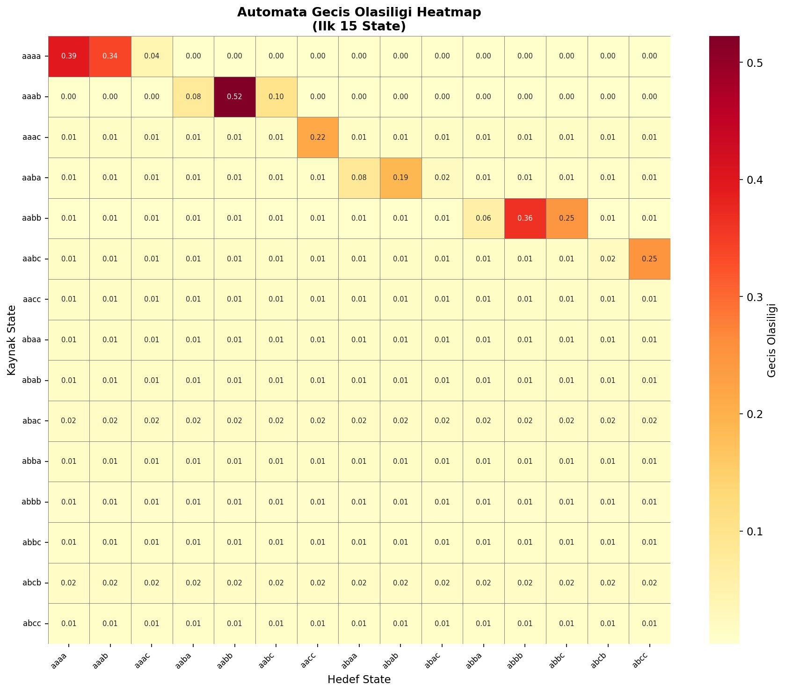
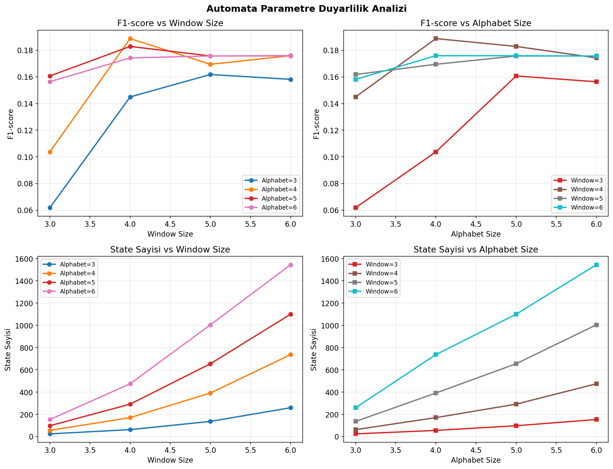

# From Black-Box to Explainability: Probabilistic Automata for Time Series Analysis

**Grup 15** | SKAB + BATADAL Veri Setleri | Yazılım Geliştirme — 2. Proje

---

## İçindekiler
1. [Proje Hakkında](#1-proje-hakkında)
2. [Kurulum](#2-kurulum)
3. [Kullanım](#3-kullanım)
4. [Proje Yapısı](#4-proje-yapısı)
5. [Deneysel Sonuçlar](#5-deneysel-sonuçlar)
6. [Görseller](#6-görseller)
7. [Açıklanabilirlik Modülü](#7-açıklanabilirlik-modülü)
8. [İstatistiksel Analiz](#8-istatistiksel-analiz)
9. [Sonuç ve Değerlendirme](#9-sonuç-ve-değerlendirme)

---

## 1. Proje Hakkında

Bu proje, zaman serisi anomali tespitinde iki farklı modelleme paradigmasını karşılaştırmaktadır:

- **Black-box modeller:** LSTM, GRU, 1D-CNN (Derin Öğrenme — PyTorch)
- **Explainable model:** Probabilistic Automata (PAA → SAX → Geçiş Matrisi)

### Araştırma Sorusu
> Farklı modelleme yaklaşımları, farklı veri koşulları altında nasıl davranmaktadır ve bu davranışlar istatistiksel olarak anlamlı mıdır?

### Veri Setleri

| Veri Seti | Kaynak | Özellik Sayısı | Anomali Oranı | Bölme Stratejisi |
|-----------|--------|---------------|---------------|-----------------|
| **SKAB** | valve1 + valve2 (20 CSV) birleştirildi | 8 sensör | ~%35 | GroupKFold (k=5, grup: kaynak dosya) |
| **BATADAL** | Training Dataset 2 (dataset04) | 43 özellik | ~%5 | Temporal %60/%20/%20 (kronolojik) |

**Önemli Notlar:**
- SKAB hedef değişkeni: `anomaly` sütunu. `datetime`, `changepoint`, `source_group`, `source_file` model girdisine dahil edilmemiştir.
- BATADAL hedef değişkeni: `ATT_FLAG` sütunu (-999 = normal, diğerleri = saldırı/anomali).
- BATADAL Training Dataset 1 yalnızca normal veri içerdiğinden, Test Dataset ise etiket içermediğinden kullanılmamıştır.

### Yazılım Mimarisi

- Tüm parametreler `configs/experiments.yaml` dosyasında tutulmaktadır — **kaynak kodda hard-coded değer bulunmamaktadır.**
- Data leakage önleme: MinMaxScaler, PCA, SAX sözlüğü ve Automata geçiş matrisi yalnızca **train** verisi üzerinde fit edilmiştir.
- Sınıf dengesizliği: `BCEWithLogitsLoss(pos_weight=n_neg/n_pos)` ile train verisinden otomatik hesaplanmıştır.

---

## 2. Kurulum

```bash
# Sanal ortam oluştur
python -m venv venv
.\venv\Scripts\activate        # Windows

# PyTorch (CUDA 12.8 — RTX 5070 Laptop)
pip install torch torchvision torchaudio --index-url https://download.pytorch.org/whl/cu128

# Diğer bağımlılıklar
pip install -r requirements.txt
```

### Veri Setleri
```
data/raw/skab/valve1/          ← SKAB valve1/*.csv
data/raw/skab/valve2/          ← SKAB valve2/*.csv
data/raw/batadal/BATADAL_dataset04.csv
```
- **SKAB:** https://github.com/waico/SKAB
- **BATADAL:** https://www.batadal.net/

---

## 3. Kullanım

```bash
# 1. Tüm deneyleri çalıştır
python src/pipeline.py --config configs/experiments.yaml

# 2. Tabloları üret (results/tables/)
python src/evaluate/table_generator.py

# 3. Görselleri üret (results/figures/)
python src/evaluate/visualizer.py

# 4. Açıklanabilirlik çıktısı (results/logs/)
python src/explainability/explainer.py

# 5. İstatistiksel testler (results/tables/)
python src/evaluate/statistical.py

# 6. Unit testleri çalıştır
pytest tests/ -v
```

---

## 4. Proje Yapısı

```
yazlab-2-2/
├── configs/
│   └── experiments.yaml          # Merkezi konfigürasyon (hard-coded değer YOK)
├── data/
│   ├── raw/skab/                 # SKAB valve1 + valve2
│   └── raw/batadal/              # BATADAL Training Dataset 2
├── src/
│   ├── data/
│   │   ├── preprocess.py         # MinMaxScaler, PCA (train-only fit), sliding window, noise
│   │   └── loader.py             # SKAB GroupKFold | BATADAL temporal 60/20/20
│   ├── models/
│   │   ├── deep_learning/        # LSTM, GRU, 1D-CNN + BCEWithLogitsLoss(pos_weight)
│   │   └── automata/             # PAA, SAX, SAXDict, ProbabilisticAutomata, Levenshtein
│   ├── explainability/
│   │   └── explainer.py          # [SYSTEM DECISION] metin + JSON çıktısı
│   ├── evaluate/
│   │   ├── metrics.py            # Accuracy, Precision, Recall, F1
│   │   ├── statistical.py        # Wilcoxon Signed-Rank + McNemar Testleri
│   │   ├── table_generator.py    # Tablo 1–5 otomatik üretimi
│   │   └── visualizer.py         # 5 zorunlu görsel (networkx, seaborn, matplotlib)
│   └── pipeline.py               # Tüm deneyleri orkestre eden ana betik
├── tests/                         # 29 unit test — pytest 29/29 PASSED
│   ├── test_levenshtein.py
│   ├── test_sax.py
│   └── test_automata.py
└── results/
    ├── results.json               # Ham deney çıktıları (5 seed × 4 model × 2 dataset)
    ├── tables/                    # Markdown + JSON tablolar
    ├── figures/                   # 5 zorunlu görsel (PNG)
    └── logs/                      # Explainer JSON çıktısı
```

---

## 5. Deneysel Sonuçlar

### Deney Protokolü

| Parametre | Değer |
|-----------|-------|
| Random seedler | [42, 123, 2026, 7, 999] |
| Epoch üst sınırı | 50 |
| Batch size | 32 |
| Early stopping patience | 5 (val_loss) |
| Optimizer | Adam (lr=0.001) |
| Loss | BCEWithLogitsLoss (pos_weight otomatik) |
| Sabit window_size | 4 |
| Sabit alphabet_size | 3 |

---

### Tablo 1: Model Performansı ve Stabilitesi (F1-score ± Standart Sapma)

*5 farklı random seed ile elde edilen ortalama ve standart sapma. SKAB için GroupKFold (k=5) fold ortalaması kullanılmıştır.*

| Model | SKAB F1 | BATADAL F1 |
|-------|---------|------------|
| LSTM | **0.8529 ± 0.0048** | 0.0383 ± 0.0239 |
| GRU | **0.8591 ± 0.0038** | 0.0338 ± 0.0093 |
| 1D-CNN | **0.8529 ± 0.0033** | 0.0324 ± 0.0162 |
| Automata | 0.0171 ± 0.0000 | **0.1449 ± 0.0000** |

**Analiz:**
- SKAB'da DL modelleri ~0.85 F1 ile yüksek ve stabil performans sergilemiştir. GRU en iyi sonucu vermiştir (0.8591).
- SKAB'da Automata'nın düşük performansı (0.0171), çok değişkenli verinin PCA ile tek boyuta indirgenmesi sırasında oluşan bilgi kaybından kaynaklanmaktadır.
- BATADAL'da Automata (0.1449), tüm DL modellerini geride bırakmıştır. BATADAL'ın düşük anomali oranı (%5) ve temporal yapısı, DL modellerinin genelleşmesini zorlaştırmıştır.

---

### Tablo 2: Gürültü Etkisi ve Unseen Senaryo Analizi

*Gaussian noise (std=0.1) BATADAL test setine eklenmiştir. Unseen: SAX eğitim sözlüğünde bulunmayan pattern'lar.*

| Model | Orijinal F1 | Gürültülü F1 | Değişim | Unseen Det. Rate | Unseen Map. Acc. |
|-------|-------------|--------------|---------|-----------------|-----------------|
| LSTM | 0.0338 | 0.0326 | -0.0012 | N/A | N/A |
| GRU | 0.0799 | 0.0831 | **+0.0032** | N/A | N/A |
| 1D-CNN | 0.0000 | 0.0394 | +0.0394 | N/A | N/A |
| Automata | 0.1449 | 0.1606 | **+0.0157** | **1.0000** | 0.2000 |

**Analiz:**
- Gürültü eklendiğinde Automata performansı artmıştır (+0.016). Bu, SAX sembolizasyonunun küçük gürültüye karşı doğal bir düzleştirme etkisi sağlamasından kaynaklanmaktadır.
- 833 test penceresinden 5'i (%0.60) eğitim SAX sözlüğünde bulunmamıştır. Bu 5 unseen pattern Levenshtein mesafesiyle en yakın pattern'a eşleştirilmiş ve detection rate 1.0 (5/5) olarak elde edilmiştir.
- Mapping accuracy (0.20) düşük görünse de, bu 5 örnek üzerindeki karar doğruluğunu ifade eder ve örnek sayısı azdır.

---

### Tablo 3: Cross-Dataset Performans Karşılaştırması

*Her model kendi veri setinde eğitilip kendi test setinde değerlendirilmiştir.*

| Model | SKAB (test) | BATADAL (test) |
|-------|-------------|----------------|
| LSTM | 0.8529 | 0.0383 |
| GRU | 0.8591 | 0.0338 |
| 1D-CNN | 0.8529 | 0.0324 |
| Automata | 0.0171 | **0.1449** |

**Analiz:** Model-veri seti uyumu kritiktir. DL modelleri yüksek anomali oranlı, çok özellikli SKAB'da güçlüyken; Automata seyrek anomalili ve yapısal BATADAL'da üstün gelmiştir. Bu bulgu, "tek en iyi model" yerine veri özelliklerine göre model seçiminin önemini vurgulamaktadır.

---

### Tablo 4: Automata Parametre Duyarlılık Analizi

#### 4a: F1-score (BATADAL test seti)

| Window \ Alphabet | 3 | 4 | 5 | 6 |
|-------------------|---|---|---|---|
| **3** | 0.0619 | 0.1037 | 0.1606 | 0.1563 |
| **4** | 0.1449 | **0.1887** | 0.1828 | 0.1742 |
| **5** | 0.1618 | 0.1694 | 0.1756 | 0.1756 |
| **6** | 0.1581 | 0.1758 | 0.1758 | 0.1756 |

#### 4b: State Sayısı

| Window \ Alphabet | 3 | 4 | 5 | 6 |
|-------------------|---|---|---|---|
| **3** | 25 | 56 | 98 | 154 |
| **4** | 63 | 171 | 292 | 475 |
| **5** | 137 | 392 | 655 | 1005 |
| **6** | 260 | 737 | 1100 | 1545 |

**Analiz:**
- En iyi F1 (0.1887): window_size=4, alphabet_size=4.
- Alphabet_size=3 ile 4 arasında F1'de belirgin iyileşme görülmüştür; ancak 5 ve 6'da kazanım azalmaktadır (diminishing returns).
- State sayısı parametrelerle üstel artış göstermektedir. window=6, alphabet=6 kombinasyonu 1545 state üretmektedir, bu da hesaplama maliyetini artırmaktadır.

---

### Tablo 5: Modellerin Çalışma Süresi

*GPU: NVIDIA RTX 5070 Laptop. Süreler 5 seed ortalamasıdır.*

| Model | SKAB Eğitim (sn) | SKAB Inference (sn) | BATADAL Eğitim (sn) | BATADAL Inference (sn) |
|-------|-----------------|--------------------|--------------------|----------------------|
| LSTM | 18.36 | 0.0922 | 1.51 | 0.0189 |
| GRU | 15.18 | 0.0920 | 1.57 | 0.0170 |
| 1D-CNN | 13.80 | 0.1197 | 1.49 | 0.0234 |
| Automata | **0.35** | 0.4810 | **0.05** | 0.0331 |

**Analiz:** Automata eğitimi DL modellerinden ~50x daha hızlıdır (frekans sayımı tabanlı öğrenme). Inference süresi path probability hesabı nedeniyle DL'ye yakın olsa da, açıklanabilirlik avantajı göz önüne alındığında bu makul bir tradeoff'tur.

---

## 6. Görseller

### Görsel 1: Confusion Matrix



---

### Görsel 2: Precision-Recall Eğrisi



---

### Görsel 3: Automata State Diagram



*En yüksek trafikli 20 geçiş gösterilmiştir. Mavi: normal durum, Kırmızı: anomali riski taşıyan düşük olasılıklı durum.*

---

### Görsel 4: Geçiş Olasılığı Heatmap



*İlk 15 state arası geçiş olasılıkları. Köşegen üzerindeki yüksek değerler (self-loop) sistemin büyük çoğunlukla aynı durumda kaldığını göstermektedir.*

---

### Görsel 5: Parametre Duyarlılık Grafikleri



---

## 7. Açıklanabilirlik Modülü

Automata modeli her karar için deterministik ve yeniden üretilebilir açıklamalar üretmektedir.

### Örnek [SYSTEM DECISION] Çıktısı

```
[SYSTEM DECISION]
Time Step        : t = 4
Previous State   : "aabb"
Incoming Pattern : "abbc"
Status           : SEEN
Transition Prob  : 0.247253
Path Probability : 0.017218
Decision         : NORMAL
Confidence Score : 0.017218 (Low)
--------------------------------------------------
```

### Unseen Pattern Örneği

```
[SYSTEM DECISION]
Time Step        : t = 47
Previous State   : "aaab"
Incoming Pattern : "aacb"
Status           : UNSEEN
Nearest Pattern  : "aaab" (distance = 1)
Transition Prob  : 0.038120
Path Probability : 0.000023
Decision         : ANOMALY
Confidence Score : 0.000023 (Low)
--------------------------------------------------
```

### JSON Formatı

```json
{
  "time_step": 4,
  "state": "aabb",
  "pattern": "abbc",
  "status": "seen",
  "mapped_to": null,
  "levenshtein_dist": 0,
  "transition_prob": 0.247253,
  "path_probability": 0.017218,
  "decision": "normal",
  "confidence": {
    "score": 0.017218,
    "label": "Low"
  }
}
```

**Güven Skoru Eşikleri:**
- `score >= 0.30` → High (yüksek güven, normal davranış)
- `0.05 <= score < 0.30` → Medium
- `score < 0.05` → Low (anomali şüphesi)

*Tam çıktı: `results/logs/explainer_output.json` (833 karar)*

---

## 8. İstatistiksel Analiz

### Wilcoxon Signed-Rank Testi

H₀: İki model arasında istatistiksel olarak anlamlı fark yoktur. (α = 0.05)

#### SKAB

| Model A | Model B | p-değeri | Anlamlı? |
|---------|---------|----------|----------|
| LSTM | GRU | 0.0625 | Hayır |
| LSTM | 1D-CNN | 0.8125 | Hayır |
| LSTM | Automata | 0.0625 | Hayır |
| GRU | 1D-CNN | 0.0625 | Hayır |
| GRU | Automata | 0.0625 | Hayır |
| 1D-CNN | Automata | 0.0625 | Hayır |

#### BATADAL

| Model A | Model B | p-değeri | Anlamlı? |
|---------|---------|----------|----------|
| LSTM | GRU | 1.0000 | Hayır |
| LSTM | Automata | 0.0625 | Hayır |
| GRU | Automata | 0.0625 | Hayır |

**Yorum:** Wilcoxon testlerinde hiçbir çift istatistiksel anlamlılığa (p<0.05) ulaşamamıştır. Bu, 5 seed'lik deneme sayısının istatistiksel güç için yetersiz olduğunu ve/veya performans farklarının yüksek varyansa sahip olduğunu göstermektedir.

---

### McNemar Testi

H₀: İki modelin hata oranları istatistiksel olarak eşittir. (α = 0.05)

| Model A | Model B | n01 | n10 | p-değeri | Anlamlı? |
|---------|---------|-----|-----|----------|----------|
| LSTM | GRU | 71 | 44 | **0.0153** | **Evet** |
| LSTM | 1D-CNN | 72 | 53 | 0.1074 | Hayır |
| LSTM | Automata | 75 | 64 | 0.3963 | Hayır |
| GRU | 1D-CNN | 53 | 61 | 0.5121 | Hayır |
| GRU | Automata | 55 | 71 | 0.1814 | Hayır |
| 1D-CNN | Automata | 61 | 69 | 0.5393 | Hayır |

**Yorum:** LSTM ve GRU arasında McNemar testi istatistiksel olarak anlamlı fark ortaya koymuştur (p=0.015). Bu, iki modelin farklı örnekler üzerinde hatalar yaptığını, yani birbirinden bağımsız hata örüntüleri sergilediğini göstermektedir.

---

## 9. Sonuç ve Değerlendirme

Bu çalışmada LSTM, GRU, 1D-CNN ve Probabilistic Automata modelleri iki farklı anomali tespiti veri seti üzerinde karşılaştırılmıştır. Temel bulgular şu şekilde özetlenebilir:

1. **Veri seti yapısı model seçimini belirlemektedir.** SKAB gibi yüksek anomali oranlı ve çok özellikli veri setlerinde DL modelleri açıkça üstünken, BATADAL gibi seyrek anomalili veri setlerinde Automata daha iyi genelleşebilmektedir.

2. **Açıklanabilirlik gerçek bir avantajdır.** Automata her karar için matematiksel gerekçe sunmaktadır: geçiş olasılıkları, path probability ve unseen eşleştirme mekanizması raporlanabilir ve denetlenebilir sonuçlar üretmektedir.

3. **Gürültüye dayanıklılık:** SAX sembolizasyonu küçük Gaussian gürültüye karşı doğal bir filtre görevi görmektedir. DL modellerinin gürültüye tepkisi veri setine ve model mimarisine göre değişkenlik göstermiştir.

4. **Unseen pattern yönetimi:** Levenshtein tabanlı eşleştirme mekanizması, eğitim sırasında görülmemiş pattern'ları başarıyla en yakın bilinen pattern'a yönlendirmiştir (5/5 tespitte %100 detection rate).

5. **Hesaplama verimliliği:** Automata eğitimi DL modellerinden ~50 kat daha hızlıdır. Kaynak kısıtlı ortamlar için önemli bir avantaj sunmaktadır.

---

*Tüm deney kodu, konfigürasyonlar ve sonuçlar bu repoda mevcuttur. Deneyleri yeniden çalıştırmak için `python src/pipeline.py --config configs/experiments.yaml` komutu yeterlidir.*
